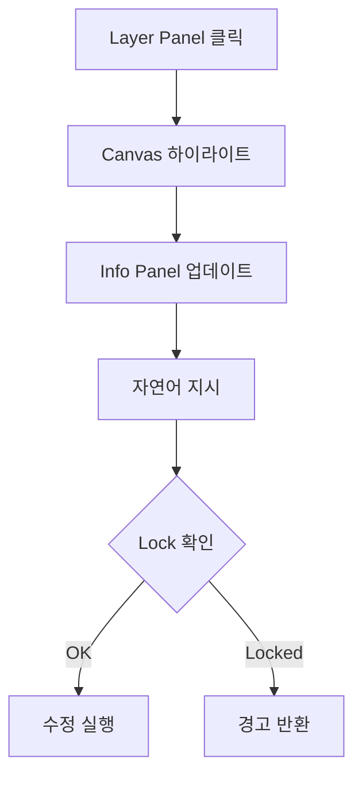
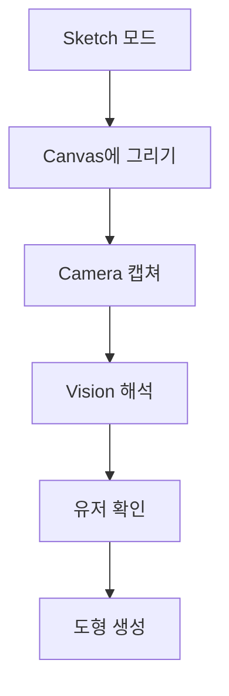
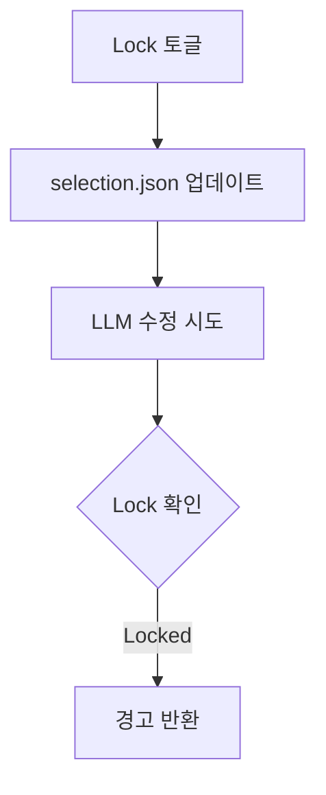

# UX Design Specification - AI-Native CAD

**Author:** Hoons
**Date:** 2025-01-06

---

## Executive Summary

### Project Vision

AI-Native CAD는 "모르는 것도 괜찮아요. 함께 만들어가요" 철학의 CAD 도구입니다. Epic 7은 인간-LLM 협업을 위한 UI를 구축하여, LLM이 생성한 코드와 유저 인터랙션의 양방향 연결을 실현합니다.

핵심 원칙:
- AI는 자동 생성기가 아닌 **협업적 창작 파트너**
- **도구 허들 제로**: 조작은 AI가, 의사결정은 인간이
- **사용자 성장**: 결과물 + CAD 지식 습득

### Target Users

| 페르소나 | 니즈 | UX 고려사항 |
|---------|------|------------|
| 커스텀 제작자 | 맞춤형 도면 | CAD 용어 모름, 결과 중심 |
| 창작자 | 아이디어 → 실체화 | 빠른 피드백 루프 필요 |
| CAD 학습자 | 배우면서 만들기 | 과정 설명이 학습으로 연결 |

공통 특성: 적극적 참여 의지, 대화 선호, 완벽보다 진행 선호

### Key Design Challenges

1. **Layer Panel 정보 구조**
   - 중첩 그룹의 계층적 표현
   - Lock/Visible 상태의 즉각적 시각화
   - 다중 선택의 직관적 UX

2. **모드 전환의 명확성**
   - 일반 모드 ↔ 스케치 모드 구분
   - 스케치 오버레이의 휘발성 인지
   - 캡쳐 → Vision 플로우의 가시성

3. **패널 레이아웃 균형**
   - Canvas 작업 공간 확보
   - 60fps 리사이즈 성능
   - 웹/Electron 동일 경험

### Design Opportunities

1. **Lock = 유저 통제권**
   - LLM 수정 불가 영역 지정 → 신뢰 구축
   - "내가 결정한 것은 건드리지 않는다" 체험

2. **스케치 → Vision Aha! Moment**
   - 대충 그린 스케치의 정확한 해석
   - "그냥 그렸는데 이해했다!" 경험

3. **선택 = 컨텍스트 제공 패턴**
   - Layer Panel 선택 + 자연어 지시
   - LLM이 정확한 대상만 수정

---

## Core User Experience

### Defining Experience

AI-Native CAD Epic 7의 핵심 경험은 **"선택 → 지시 → 확인"** 루프입니다.

1. **선택**: Layer Panel에서 수정할 엔티티 클릭
2. **지시**: 자연어로 변경 요청 ("더 길게", "빨간색으로")
3. **확인**: Canvas에서 변경 결과 즉시 확인

이 루프가 끊김 없이 반복되면서 유저는 "내가 만들고 있다"는 느낌을 받습니다.

### Platform Strategy

| 항목 | 결정 | 근거 |
|------|------|------|
| **Primary** | Electron Desktop | 오프라인 동작, 파일 접근 |
| **Secondary** | Web Browser | 빠른 테스트, 데모 |
| **입력** | 마우스 + 키보드 | CAD 작업 특성 |
| **화면** | 1280px+ 권장 | 3패널 레이아웃 |

### Effortless Interactions

1. **선택 = 컨텍스트**
   - Layer Panel 클릭만으로 LLM이 대상 인식
   - Ctrl+클릭으로 다중 선택, 그룹 선택 지원

2. **스케치 = 빠른 의도 표현**
   - 스케치 모드 → 대충 그리기 → 캡쳐 버튼
   - Vision이 의도 해석, 정확한 도형 생성

3. **Lock = 원클릭 보호**
   - 자물쇠 아이콘 토글
   - LLM 수정 시도 시 경고 반환

### Critical Success Moments

| Moment | 트리거 | 유저 반응 |
|--------|--------|----------|
| **정확한 수정** | 선택한 엔티티만 변경됨 | "정확히 그거야!" |
| **의도 이해** | 스케치 → 원하는 도형 | "진짜 이해했네?" |
| **통제감** | Lock이 수정 차단 | "내가 컨트롤해" |
| **첫 성공** | 첫 자연어 명령 성공 | "말로 되네!" |

### Experience Principles

1. **선택이 곧 컨텍스트다**
   - 유저의 명시적 선택 = LLM의 작업 범위
   - 선택 없이 전체 수정 요청 시 확인 요청

2. **보이는 것만 수정된다**
   - Hidden 엔티티는 수정 대상에서 제외
   - "숨기면 안전하다"는 멘탈 모델

3. **Lock은 약속이다**
   - Lock된 항목 수정 시도 = 경고 반환
   - 유저와 LLM 사이의 계약

4. **스케치는 의도 표현이다**
   - 정확도보다 의도 전달이 목적
   - Vision이 "대충"을 "정확히"로 번역

---

## Desired Emotional Response

### Primary Emotional Goals

1. **통제감 (In Control)**
   - "AI가 도와주지만, 결정은 내가 한다"
   - 유저의 선택 = LLM의 작업 범위
   - Lock으로 명확한 경계 설정

2. **성장감 (Growing)**
   - "나도 이제 CAD를 알게 됐다"
   - 대화 속에서 자연스러운 용어 학습
   - 결과물과 지식 둘 다 얻음

3. **협업감 (Collaborating)**
   - "혼자가 아니라 함께 만든다"
   - AI가 질문하고 선택지 제시
   - 공동 창작자로서의 관계

### Emotional Journey Mapping

| 단계 | 목표 감정 | UX 지원 |
|------|----------|---------|
| 첫 만남 | 호기심, 부담 없음 | 빈 캔버스 + 간단한 시작 안내 |
| 첫 성공 | 놀라움, "되네!" | 5분 내 첫 결과물 |
| 협업 체험 | 통제감 | 선택 → 수정 → 확인 루프 |
| 스케치 해석 | 감탄 | Vision의 정확한 의도 파악 |
| Lock 사용 | 신뢰 | "내 영역 존중" 체험 |
| 완성 | 성취감, 소유감 | 내가 만들었다는 인식 |

### Micro-Emotions

| 감정 | 목표 | UX 접근 |
|------|------|---------|
| 자신감 | ✅ 유지 | 명확한 피드백, 예측 가능한 동작 |
| 신뢰 | ✅ 구축 | Lock 약속 준수, 정확한 수정 |
| 성취 | ✅ 제공 | 빈번한 작은 성공 |
| 통제 | ✅ 강화 | Hidden/Lock으로 안전지대 |

### Design Implications

1. **통제감을 위한 UX**
   - 선택 없이 전체 수정 시 확인 요청
   - Lock된 항목 수정 시도 → 명확한 경고
   - 변경 사항 before/after 표시

2. **성장감을 위한 UX**
   - AI 응답에 "왜" 설명 포함
   - 용어 사용 시 간단한 부연
   - 점진적 복잡도 증가

3. **협업감을 위한 UX**
   - 선택지 제시 (A vs B)
   - 트레이드오프 설명
   - "어떻게 할까요?" 질문

### Emotional Design Principles

1. **존중받는 느낌**: 유저 결정을 AI가 따름
2. **동반자 느낌**: AI가 답이 아닌 질문을 함
3. **성장하는 느낌**: 결과물과 함께 지식도 쌓임
4. **안전한 느낌**: Lock/Hidden으로 보호 가능

---

## UX Pattern Analysis & Inspiration

### Inspiring Products Analysis

| 제품 | 영감 포인트 |
|------|-----------|
| **Figma** | Layer Panel 트리뷰, 눈/잠금 아이콘, 선택 피드백 |
| **VS Code** | 3패널 레이아웃, 드래그 리사이즈, StatusBar |
| **Claude Code** | AI 협업 패턴 (질문→확인→실행), 투명성 |

### Transferable UX Patterns

**Navigation:**
- Figma식 Layer 트리뷰 → 엔티티/그룹 계층 표현
- VS Code식 3패널 → Layer/Canvas/Info 분리

**Interaction:**
- 눈/잠금 아이콘 토글 (Figma)
- Ctrl+클릭 다중 선택 (공통)
- 드래그 패널 리사이즈 (VS Code)

**AI Collaboration:**
- 승인 후 실행 (Claude Code)
- 진행 상황 투명 표시 (Claude Code)
- "왜"를 함께 설명 (Claude Code)

### Anti-Patterns to Avoid

| 피해야 할 패턴 | 이유 |
|---------------|------|
| 자동 실행 | 통제감 상실 |
| 복잡한 툴바 | AI가 도구 선택하므로 불필요 |
| 모달 팝업 | 플로우 중단 |
| 숨겨진 기능 | Layer Panel에 명시적 노출 |

### Design Inspiration Strategy

| 전략 | 내용 |
|------|------|
| **Adopt** | Figma Layer Panel, VS Code 3패널, Claude Code 협업 패턴 |
| **Adapt** | Properties → Info Panel (읽기 전용) |
| **Avoid** | 복잡한 툴바, 단축키 의존, 모달 |

---

## Design System Foundation

### Design System Choice

**TailwindCSS 4.x** - Utility-First CSS Framework

Architecture 문서에서 결정된 스택과 일치하며, 다음 이유로 적합:
- 빠른 프로토타이핑 (유틸리티 클래스)
- 작은 번들 (JIT 컴파일)
- 커스터마이징 용이 (tailwind.config.js)

### Rationale for Selection

| 요소 | TailwindCSS 적합성 |
|------|-------------------|
| 팀 규모 | ✅ 1인 개발에 효율적 |
| 속도 | ✅ 빠른 반복 가능 |
| 유연성 | ✅ 커스텀 디자인 가능 |
| 유지보수 | ✅ 명시적 클래스명 |

### Implementation Approach

**레이아웃:**
```tsx
<div className="flex h-screen bg-panel-bg">
  <LayerPanel className="w-52 border-r border-panel-border" />
  <Canvas className="flex-1" />
  <InfoPanel className="w-72 border-l border-panel-border" />
</div>
```

**컴포넌트 스타일링:**
- 각 컴포넌트 내에서 Tailwind 클래스 직접 사용
- 반복 패턴은 @apply로 추출
- 복잡한 상태는 clsx/cn 유틸리티 활용

### Customization Strategy

**Design Tokens (tailwind.config.js):**

| 토큰 | 용도 |
|------|------|
| `colors.panel` | 패널 배경/테두리 |
| `colors.selection` | 선택 하이라이트 |
| `colors.status` | Lock/Hidden 상태 |
| `colors.canvas` | 캔버스 영역 |

**확장 계획:**
- 라이트/다크 테마 (향후)
- 고대비 모드 (접근성)

---

## Defining Experience

### The Core Interaction

**"선택하고 말하면 바뀐다"**

Layer Panel에서 엔티티 선택 + 자연어 지시 = 해당 엔티티만 수정

이것이 AI-Native CAD의 핵심 경험입니다. 이 인터랙션을 완벽하게 구현하면 나머지는 따라옵니다.

### User Mental Model

| 개념 | 유저 이해 |
|------|----------|
| 선택 | = 작업 대상 지정 |
| Lock | = AI 수정 금지 |
| Hidden | = 렌더링 제외 |
| 스케치 | = 의도 표현 |

### Success Criteria

1. **정확성**: 선택한 것만 수정됨
2. **속도**: 1초 내 응답 시작
3. **신뢰**: Lock 100% 존중
4. **예측성**: 예상대로 동작

### Novel UX Patterns

| 패턴 | 학습 방법 |
|------|----------|
| 선택 = LLM 컨텍스트 | Figma와 동일하게 직관적 |
| Lock = AI 금지 | 첫 사용 시 피드백 |
| 스케치 → Vision | "대충 그려도 됩니다" 안내 |

### Experience Mechanics

```
[Initiation] Layer Panel 클릭
     ↓
[Feedback] Canvas 하이라이트 + Info Panel 업데이트
     ↓
[Interaction] 자연어 지시 입력
     ↓
[Processing] LLM이 selection.json 참조하여 실행
     ↓
[Completion] Canvas에 결과 반영
```

---

## Visual Design Foundation

### Color System

**Dual Theme:**

| 토큰 | Dark | Light |
|------|------|-------|
| `bg-app` | `#1e1e1e` | `#f5f5f5` |
| `bg-panel` | `#252526` | `#ffffff` |
| `bg-canvas` | `#2d2d2d` | `#e8e8e8` |
| `border` | `#3c3c3c` | `#e0e0e0` |
| `text-primary` | `#cccccc` | `#1e1e1e` |
| `hover` | `rgba(255,255,255,0.05)` | `rgba(0,0,0,0.05)` |

**Accents:** selection `#0d99ff` / lock `#ffab00` / hidden `#8c8c8c`

### Typography System (Figma)

- **Font:** Inter, system-ui, sans-serif / Roboto Mono
- **Scale:** 11 / 12 / 13 / 14 / 16px
- **Line Height:** 16 / 20 / 24px

### Icon System (Lucide)

| 용도 | 아이콘 |
|------|--------|
| Visible | Eye / EyeOff |
| Lock | Lock / Unlock |
| Group | ChevronRight / ChevronDown |
| Sketch | Pencil / Eraser / Trash2 / Camera |

### Component Styles (shadcn 참조)

- **Hover:** `hover:bg-hover` (5% opacity overlay)
- **Active:** `active:bg-active` (10% opacity overlay)
- **Selected:** `data-[selected]:bg-selection-bg`
- **Border Radius:** 4px / 6px / 8px
- **Transition:** 150ms ease

### Accessibility

- WCAG AA 대비 준수
- Focus ring: `ring-2 ring-selection`
- 테마: prefers-color-scheme 자동 감지

---

## Design Direction Decision

### Design Directions Explored

| Direction | 레이아웃 | 특징 |
|-----------|---------|------|
| A. VS Code | 좌/중/우 3패널 | 정보 상시 표시 |
| B. Figma | 캔버스 + 우측 통합패널 | 캔버스 최대화 |
| C. 미니멀 | 풀스크린 + 오버레이 | 캔버스 집중 |

### Chosen Direction

**Direction A + Top Bar + Status Bar**

```
┌──────────────────────────────────────────────────────────────┐
│ 🔶 scene.json │ Grid ☑️ │ Rulers ☑️ │ ✏️ Sketch │  ☀️  ⚙️  │
├──────────┬───────────────────────────────┬───────────────────┤
│  Layer   │           Canvas              │       Info        │
│  Panel   │                               │       Panel       │
├──────────┴───────────────────────────────┴───────────────────┤
│ Normal │ Entities: 47 │ Selected: 3 │ x: 120, y: -45 │ 100% │
└──────────────────────────────────────────────────────────────┘
```

### Top Bar

| 영역 | 내용 |
|------|------|
| 좌측 | 앱 로고 + 씬 파일명 |
| 중앙 | Grid, Rulers, Sketch 토글 |
| 우측 | 테마, 설정, 윈도우 컨트롤 |

### Status Bar

| 항목 | 표시 |
|------|------|
| Mode | Normal / Sketch |
| Entities | 전체 수 |
| Selected | 선택 수 |
| Coordinates | 마우스 x, y |
| Zoom | 줌 % |

### Design Rationale

1. 타겟 유저에게 친숙한 레이아웃
2. Top Bar로 빠른 모드/뷰 전환
3. Status Bar로 작업 컨텍스트 상시 파악
4. CAD 표준인 좌표 표시 포함

### Implementation Approach

- **Top Bar:** 32px 고정 높이
- **Status Bar:** 24px 고정 높이
- **Panels:** react-resizable-panels
- **테마:** prefers-color-scheme + 수동 토글

---

## User Journey Flows

### Journey 1: Selection → Modification



**핵심**: 선택 즉시 피드백, Lock 사전 확인

### Journey 2: Sketch → Vision



**핵심**: 모드 명시, 스케치 휘발성, 유저 확인 후 실행

### Journey 3: Lock Protection



**핵심**: 즉각 토글 피드백, LLM 필수 확인, 명확한 경고

### Journey Patterns

| 패턴 | 적용 |
|------|------|
| **즉각 피드백** | 100ms 내 UI 반응 |
| **상태 동기화** | Canvas ↔ Panels |
| **Lock 존중** | LLM 수정 전 필수 확인 |
| **확인 후 실행** | 중요 액션은 유저 승인 |

### Flow Optimization Principles

1. **최소 단계**: 선택 → 지시 → 완료
2. **명확한 상태**: 모드와 선택 항상 visible
3. **안전한 되돌리기**: 실수해도 복구 가능

---

## Component Strategy

### Design System Components

TailwindCSS + shadcn 스타일 직접 구현:
- Button, IconButton, Toggle, Checkbox, Tooltip, Separator

### Custom Components

**Layout:**
- TopBar (32px) - 모드 토글, 테마
- StatusBar (24px) - 모드, 좌표, 줌
- PanelLayout - react-resizable-panels

**Layer Panel:**
- LayerPanel - 컨테이너
- LayerTree - 재귀적 트리
- LayerItem - 이름, Lock, Visible

**Canvas:**
- Canvas - 렌더링, Pan/Zoom
- CanvasRenderer - 도형별 그리기
- SketchOverlay - 그리기 도구

**Info Panel:**
- InfoPanel - 컨테이너
- SelectionInfo - bounds, transform
- SceneInfo - 전체 정보

### Implementation Roadmap

| Phase | 컴포넌트 | 우선순위 |
|-------|---------|---------|
| 1 | PanelLayout, LayerPanel, Canvas, StatusBar | P0 |
| 2 | TopBar, InfoPanel, SketchOverlay | P1 |
| 3 | GridOverlay, SceneInfo | P2 |

---

## UX Consistency Patterns

### Selection Patterns

| 액션 | 결과 |
|------|------|
| 클릭 | 단일 선택 |
| Ctrl+클릭 | 추가/제거 토글 |
| Shift+클릭 | 범위 선택 |
| 빈 영역 클릭 | 선택 해제 |

### State Indication

| 상태 | 표현 |
|------|------|
| Hover | `bg-hover` |
| Selected | `bg-selection-bg` |
| Locked | 🔒 + `text-lock` |
| Hidden | 👁️‍🗨️ + `opacity-50` |

### Feedback Patterns

- **즉각 피드백**: 100ms 내 UI 반응
- **Lock 경고**: "'{name}'은(는) 잠겨 있습니다"
- **선택 필요**: "수정할 엔티티를 선택해주세요"

### Mode Patterns

| 요소 | Normal | Sketch |
|------|--------|--------|
| Status Bar | "Normal" | "Sketch" |
| Top Bar 버튼 | 비활성 | 활성 (하이라이트) |
| Canvas 커서 | default | ✏️ 펜/연필 (SVG 커서) |
| Canvas 클릭 | 선택 | 그리기 |
| Escape | - | Normal 복귀 |

---

## Responsive Design & Accessibility

### Responsive Strategy

**Desktop-First 접근:**
- 기본 해상도: 1280px 이상
- 최소 지원: 1024px
- Layer Panel: 150-300px (리사이즈 가능)
- Info Panel: 200-400px (리사이즈 가능)
- Canvas: flex-1 (나머지 공간)

**Mobile 미지원:**
- 1024px 미만에서 "데스크톱 사용 권장" 안내
- CAD 작업 특성상 모바일 최적화 불필요

### Breakpoint Strategy

| 크기 | 대응 |
|------|------|
| ≥1280px | 기본 3패널 레이아웃 |
| 1024-1279px | 컴팩트 모드 (패널 최소 너비) |
| <1024px | 지원 안 함 (경고 표시) |

### Accessibility Strategy

**WCAG AA 준수:**

| 항목 | 요구 | 달성 |
|------|------|------|
| 색상 대비 | 4.5:1 이상 | 10.4:1 (#cccccc on #1e1e1e) |
| 포커스 표시 | 명확한 ring | `ring-2 ring-selection` |
| 키보드 탐색 | 전체 기능 접근 | Tab, Arrow, Enter, Escape |

**키보드 내비게이션:**

| 키 | 동작 |
|-----|------|
| Tab | 패널/요소 간 이동 |
| Arrow | 트리 항목 탐색 |
| Enter | 선택/확인 |
| Escape | 모드 해제/선택 해제 |
| Space | 토글 (Lock, Visible) |

**ARIA 라벨:**
- `aria-label`: 모든 아이콘 버튼
- `aria-expanded`: 트리 그룹 확장 상태
- `aria-selected`: 선택된 레이어
- `role="tree"`: Layer Panel 트리뷰

### Testing Strategy

**해상도 테스트:**
- 1280x720 (최소 권장)
- 1920x1080 (일반)
- 2560x1440 (고해상도)

**브라우저 테스트:**
- Chrome 120+
- Firefox 120+
- Safari 17+ (Electron 내장)

**접근성 테스트:**
- axe-core 자동화 검사
- 키보드 전용 내비게이션 테스트
- 스크린 리더 테스트 (선택적)

### Implementation Guidelines

**반응형 개발:**
```tsx
// TailwindCSS 클래스 사용
<div className="min-w-[1024px]">
  <LayerPanel className="w-52 min-w-[150px] max-w-[300px]" />
  <Canvas className="flex-1 min-w-[400px]" />
  <InfoPanel className="w-72 min-w-[200px] max-w-[400px]" />
</div>
```

**접근성 개발:**
```tsx
// 포커스 관리
<button
  aria-label="Lock entity"
  className="focus:ring-2 focus:ring-selection focus:outline-none"
  onKeyDown={(e) => e.key === 'Enter' && toggle()}
>
  <Lock size={14} />
</button>
```
